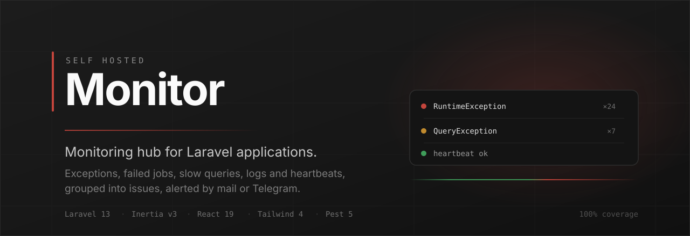

Client projects install the companion [laravel-monitor-client](https://github.com/marekmiklusek/laravel-monitor-client) package, which reports exceptions, failed jobs, slow queries, logs and heartbeats to this central app. Incoming occurrences are grouped into issues, browsable in an admin UI, and silent projects trigger notifications by mail or Telegram.

## Requirements

- PHP 8.4
- MySQL
- Node.js (npm)
- [Laravel Herd](https://herd.laravel.com) or any other local server

## Setup

```bash
composer setup
```

This installs Composer and npm dependencies, copies `.env`, generates the app key, runs migrations and builds the frontend. For development:

```bash
composer dev
```

## Configuration

| Env variable | Default | Purpose |
| --- | --- | --- |
| `MONITORING_ADMIN_EMAIL` | `admin@example.com` | Recipient of notification mails |
| `MONITORING_CHANNELS` | `mail` | Comma separated notification channels (`mail`, `telegram`) |
| `MONITORING_ISSUE_NOTIFICATION_THROTTLE_MINUTES` | `15` | Minimum gap between issue notifications per project |
| `MONITORING_HEARTBEAT_THRESHOLD_MINUTES` | `15` | Minutes without a heartbeat before a project counts as stale |
| `MONITORING_RECENT_OCCURRENCE_MINUTES` | `30` | Window for highlighting recently seen issues in the inbox |
| `APP_LOCALE` | `en` | Admin UI language (`en` or `cs`) |

Mail must be configured (`MAIL_*`) for notifications to be delivered.

### Telegram notifications

Notifications can also go to Telegram alongside mail. Set up a bot once:

1. Open a chat with [@BotFather](https://t.me/BotFather), send `/newbot` and follow the prompts. It replies with the bot token.
2. Send any message to your new bot, then open `https://api.telegram.org/bot<TOKEN>/getUpdates` in a browser and read `result[0].message.chat.id`. For a group, add the bot to it first – group chat ids are negative.
3. Add the three variables:

```
MONITORING_CHANNELS=mail,telegram
TELEGRAM_BOT_TOKEN=123456:ABC-DEF...
MONITORING_TELEGRAM_CHAT_ID=987654321
```

If `telegram` is listed but the token or chat id is missing, the channel is skipped with a logged warning instead of failing. A failing Telegram API never blocks the mail channel either – the error is logged and the rest of the notification still goes out.

## Client package

Monitored applications use [laravel-monitor-client](https://github.com/marekmiklusek/laravel-monitor-client) to send data here. Create a project in the admin UI, copy its token and configure the client with this app's URL and that token – see the client's README for installation details. The contract below is what the client speaks.

## Ingest API

Client projects authenticate with a bearer token. Tokens are created in the admin UI under Projects, shown exactly once, and stored as a SHA-256 hash.

```
POST /api/ingest
Authorization: Bearer <token>
Content-Type: application/json
```

```json
{
    "schema_version": 1,
    "sent_at": "2026-01-01T12:00:00Z",
    "environment": "production",
    "occurrences": [
        {
            "type": "exception",
            "occurred_at": "2026-01-01T11:59:58Z",
            "exception_class": "RuntimeException",
            "message": "Order 1234 failed",
            "file": "/app/Http/Controllers/OrderController.php",
            "line": 42,
            "stack": [],
            "context": {},
            "breadcrumbs": []
        }
    ]
}
```

- `type` is one of `exception`, `failed_job`, `slow_query`, `heartbeat`, `log`.
- At most 100 occurrences per request; an unknown `schema_version` returns 422.
- Requests are rate limited to 120 per minute per project and answered with 429 beyond that. Payloads larger than 512 KB are rejected with 413 before authentication.
- The endpoint validates, dispatches a queued job and responds with `202 Accepted` and an empty body. All processing happens in the queue.

### Grouping

Occurrences are grouped into issues by fingerprint:

- `exception`, `failed_job`, `slow_query` – SHA-1 of type, exception class, file and line. The message is excluded on purpose, since it tends to carry volatile identifiers.
- `log` – SHA-1 of type, channel and the normalized message. Numbers, UUIDs and email addresses are replaced with placeholders before hashing.
- `heartbeat` – not stored; it only updates the project's `last_heartbeat_at`.

A new occurrence on a resolved issue reopens it. Ignored issues stay ignored. Each issue keeps its 50 most recent occurrences; older ones are pruned.

## Notifications

Every notification goes to the channels listed in `MONITORING_CHANNELS`.

**Heartbeats.** `monitor:check-heartbeats` runs every five minutes. A project whose last heartbeat is older than the threshold triggers a single alert; a recovery notification follows once heartbeats resume.

**Issues.** A first-ever occurrence of a fingerprint notifies as a new issue, and an occurrence on a resolved issue notifies as a regression. Repeat occurrences of an already open issue stay silent. Notifications are throttled to one per project per throttle window; anything raised inside that window is held and sent as a single digest by `monitor:flush-issue-notifications`, which also runs every five minutes.

## Retention

`monitor:prune` runs daily at 03:00. It deletes resolved and ignored issues last seen more than 90 days ago along with their occurrences, and any occurrence older than 30 days regardless of issue status. Open issues are never pruned. Both windows are configurable in `config/monitoring.php`.

## Scheduler

The heartbeat, digest and prune commands all need the scheduler running:

```bash
php artisan schedule:work
```

## Admin UI

- **Dashboard** – project cards with open issue counts and heartbeat status.
- **Issues** – inbox across all projects with status and project filters, recent activity highlighting and pagination.
- **Issue detail** – stack trace, request context, breadcrumbs and switchable occurrences, plus resolve/ignore/reopen actions.
- **Projects** – create projects, reveal the token once, regenerate tokens.

Registration is controlled by `FORTIFY_REGISTRATION_ENABLED`. The UI ships with English and Czech translations; switch with `APP_LOCALE`.

## Testing

```bash
composer test                     # type coverage, tests at exactly 100% coverage, lint, static analysis
./vendor/bin/pest --parallel      # test suite only
```

The project enforces 100% code coverage, 100% type coverage, PHPStan at level max and Pint/Rector formatting.

## License

Released under the [MIT License](LICENSE).
